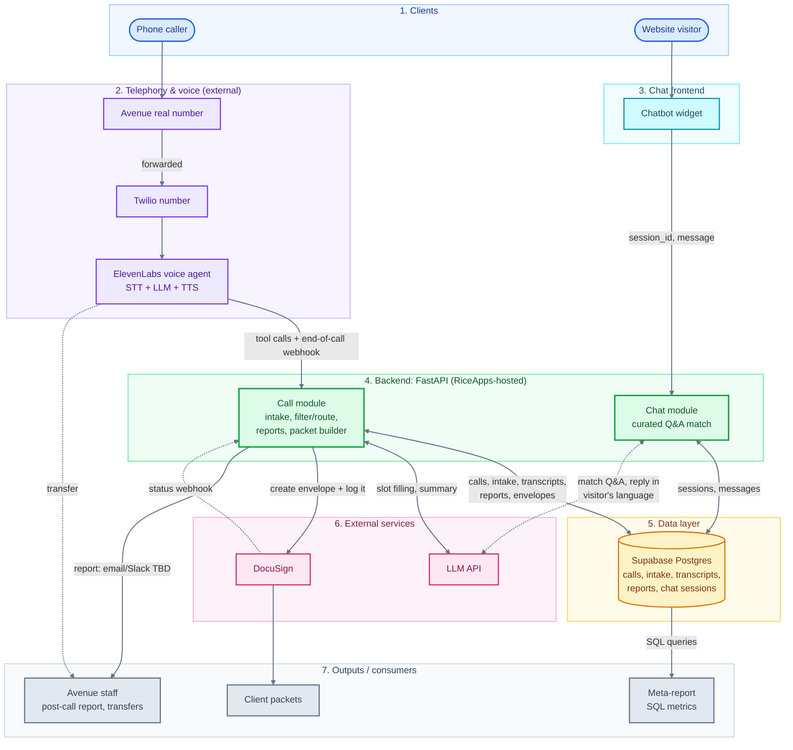

## Project Architecture Diagram:

```mermaid

flowchart TB
    subgraph S1["1. Clients"]
        Caller([Phone caller])
        Visitor([Website visitor])
    end

    subgraph S2["2. Telephony & voice (external)"]
        RealNum[Avenue real number]
        TwilioNum[Twilio number]
        Voice["ElevenLabs voice agent<br/>STT + LLM + TTS"]
    end

    subgraph S3["3. Chat frontend"]
        Widget[Chatbot widget]
    end

    subgraph S4["4. Backend: FastAPI (RiceApps-hosted)"]
        CallMod["Call module<br/>intake, filter/route,<br/>reports, packet builder"]
        ChatMod["Chat module<br/>curated Q&A match"]
    end

    subgraph S5["5. Data layer"]
        DB[("Supabase Postgres<br/>calls, intake, transcripts,<br/>reports, chat sessions")]
    end

    subgraph S6["6. External services"]
        LLM[LLM API]
        DocuSign[DocuSign]
    end

    subgraph S7["7. Outputs / consumers"]
        Staff["Avenue staff<br/>post-call report, transfers"]
        ClientDocs[Client packets]
        Metrics["Meta-report<br/>SQL metrics"]
    end

    Caller --> RealNum -->|forwarded| TwilioNum --> Voice
    Voice -->|tool calls + end-of-call webhook| CallMod

    Visitor --> Widget -->|session_id, message| ChatMod

    CallMod <-->|calls, intake, transcripts,<br/>reports, envelopes| DB
    ChatMod <-->|sessions, messages| DB
    CallMod <-->|slot filling, summary| LLM
    ChatMod <-.->|match Q&A, reply in<br/>visitor's language| LLM
    CallMod -->|create envelope + log it| DocuSign
    DocuSign -.->|status webhook| CallMod

    CallMod -->|report: email/Slack TBD| Staff
    Voice -.->|transfer| Staff
    DocuSign --> ClientDocs
    DB -->|SQL queries| Metrics

    classDef clients fill:#DBEAFE,stroke:#2563EB,color:#1E3A8A,stroke-width:2px

    classDef voice fill:#EDE9FE,stroke:#7C3AED,color:#4C1D95,stroke-width:2px

    classDef frontend fill:#CFFAFE,stroke:#0891B2,color:#164E63,stroke-width:2px

    classDef backend fill:#DCFCE7,stroke:#16A34A,color:#14532D,stroke-width:2.5px

    classDef data fill:#FEF3C7,stroke:#D97706,color:#78350F,stroke-width:2px

    classDef external fill:#FCE7F3,stroke:#DB2777,color:#831843,stroke-width:2px

    classDef output fill:#E2E8F0,stroke:#64748B,color:#334155,stroke-width:2px

    class Caller,Visitor clients
    class RealNum,TwilioNum,Voice voice
    class Widget frontend
    class CallMod,ChatMod backend
    class DB data
    class LLM,DocuSign external
    class Staff,ClientDocs,Metrics output

    style S1 fill:#F0F7FF,stroke:#93C5FD,stroke-width:1.5px,color:#1E3A8A

    style S2 fill:#F7F4FF,stroke:#C4B5FD,stroke-width:1.5px,color:#4C1D95

    style S3 fill:#F0FDFF,stroke:#67E8F9,stroke-width:1.5px,color:#164E63

    style S4 fill:#F0FDF4,stroke:#86EFAC,stroke-width:2px,color:#14532D

    style S5 fill:#FFFBEB,stroke:#FCD34D,stroke-width:1.5px,color:#78350F

    style S6 fill:#FDF2F8,stroke:#F9A8D4,stroke-width:1.5px,color:#831843

    style S7 fill:#F8FAFC,stroke:#CBD5E1,stroke-width:1.5px,color:#334155

    linkStyle default stroke:#64748B,stroke-width:1.7px

```